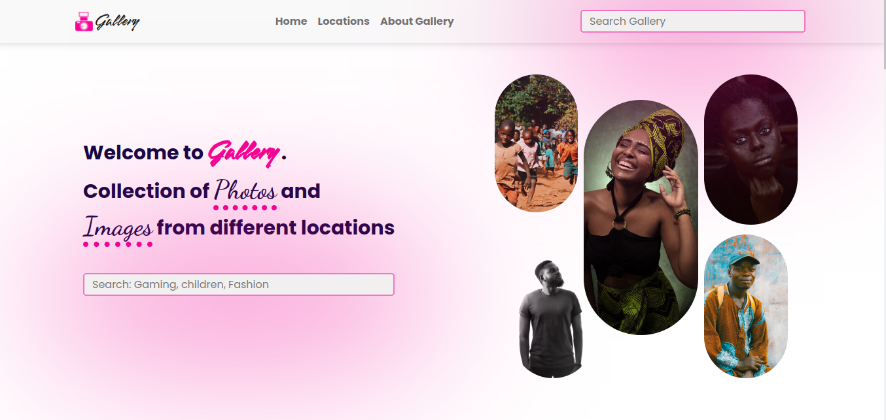

# GALLERY

## Project Description

Gallery is a Photo Gallery application showcasing a collection of pictures built using Python - Django.

- Users get can view photos uploaded by admin.
- Users can see photos based on the location, by clicking on the listed locations in the menu.
- They can also copy the link to a photo to paste at their discretion.
- Users can search for photos based on categories.

## Getting Started

To clone the repository, run:

    git clone https://github.com/sirgama/gallery

Then navigating to the cloned directory:

    cd gallery
### Prerequisites

Requirements for the software and other tools to build, test and run: 
- asgiref==3.5.2
- Django==4.0.4
- Pillow==9.1.1
- psycopg2==2.9.3
- sqlparse==0.4.2

### Setup Instructions

You'll first need to setup your virtual environment

Then install all project dependencies by running:

    pip install -r requirements.txt

Then do a migration

    python3.9 manage.py migrate

Then start the server by running:

    python3.9 manage.py runserver

## Running the tests

How to run the automated tests for this application

    python3.9 manage.py test gallery

## Deployment

The application is deployed on Heroku and is live on this link:

[https://gallery-sg.herokuapp.com/](https://gallery-sg.herokuapp.com/)

## Built With

  - [Django 4.0.4](https://docs.djangoproject.com/en/4.0/releases/4.0.4/) - Back end logic of the application.
  - [Material Design Bootstrap](https://mdbootstrap.com/) - Used for overall design and responsive site
  - [Pillow 9.1.1](https://pillow.readthedocs.io/en/stable/) - Used for image uploads.

## Contributing

Please read [CONTRIBUTING.md](CONTRIBUTING.md) for details on our code
of conduct, and the process for submitting pull requests to us.

## Author

  - **Gamaliel Sirengo** - *Full Stack Developer* -
    [Telegram](https://t.me/sirgama)

## License

This project is licensed under the [CC0 1.0 Universal](LICENSE.md)
Creative Commons License - see the [LICENSE.md](LICENSE.md) file for
details

