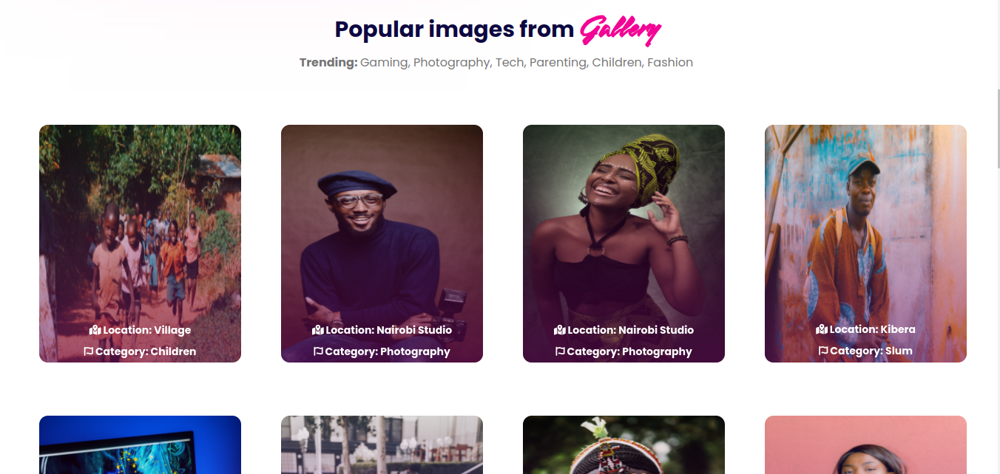

# GALLERY

## Project Description

Gallery is a Photo Gallery application showcasing a collection of pictures built using Python - Django.

- Users get can view photos uploaded by admin.
- Users can see photos based on the location, by clicking on the listed locations in the menu.
- They can also copy the link to a photo to paste at their discretion.
- Users can search for photos based on categories.

## Getting Started

To clone the repository, run:

    git clone https://github.com/sirgama/gallery

Then navigating to the cloned directory:

    cd gallery
## BDD

### Prerequisite
The Galleria project requires a prerequisite understanding of the following:
- Django Framework
- Python3.9
- Postgres
- Python virtualenv

## Setup and installation

#### Clone the Repo
####  Activate virtual environment
Activate virtual environment using python3.9 as default handler
    `virtualenv -p /usr/bin/python3.9 genv && source genv/bin/activate`
####  Install dependancies
Install dependancies that will create an environment for the app to run `pip3 install -r requirements.txt`
####  Create the Database
    - psql
    - CREATE DATABASE gallery;
####  .env file
Create .env file and paste paste the following filling where appropriate:

    SECRET_KEY = '<Secret_key>'
    DBNAME = 'gallery'
    USER = '<Username>'
    PASSWORD = '<password>'
    DEBUG = True
#### Run initial Migration
    python3.9 manage.py makemigrations gallery
    python3.9 manage.py migrate
#### Run the app
    python3.9 manage.py runserver
    Open terminal on localhost:8000

## Deployment

The application is deployed on Heroku and is live on this link:

[https://gallery-s.herokuapp.com/](https://gallery-s.herokuapp.com/)

## Built With

  - [Django 4.0.4](https://docs.djangoproject.com/en/4.0/releases/4.0.4/) - Back end logic of the application.
  - [Material Design Bootstrap](https://mdbootstrap.com/) - Used for overall design and responsive site
  - [Pillow 9.1.1](https://pillow.readthedocs.io/en/stable/) - Used for image uploads.

## Contributing

Please read [CONTRIBUTING.md](CONTRIBUTING.md) for details on our code
of conduct, and the process for submitting pull requests to us.

## Author

  - **Gamaliel Sirengo** - *Full Stack Developer* -
    [Telegram](https://t.me/sirgama)

## License

This project is licensed under the [CC0 1.0 Universal](LICENSE.md)
Creative Commons License - see the [LICENSE.md](LICENSE.md) file for
details

